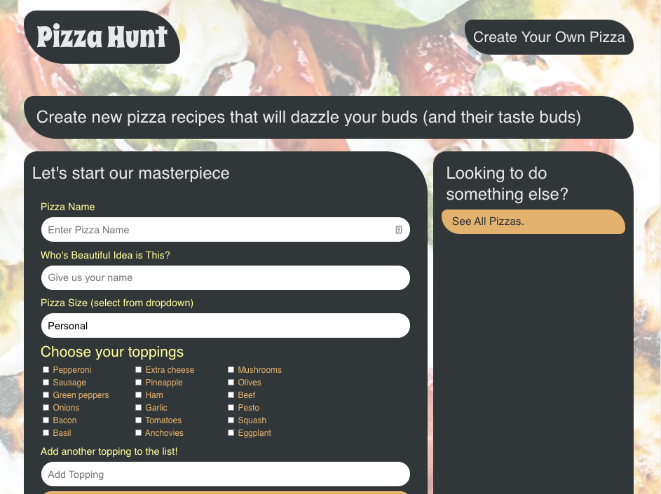

# pizza-hunt

## Description
Pizza Hunt, is a fully deployed, cloud-based, P2P, social application on Heroku server. Users are able to create unique Pizza recipes by choosing various toppings from the list or adding their own. Other users can comment and reply to these recipe posts, and the app offers offline utility. 

For this application, I built the NoSQL backend using MongoDB, Mongoose, and Express.JS, created a MongoDB Atlas database, and connected to Heroku server.

* Created models with Mongoose
* Utilized virtuals to extend model's functionality to account for scalability
* Created subschemas and subdouments with mongoose
* Added IndexedDB to add offline functionality
* Validated models to normalize data
* Deployed application to Heroku
* Used MongoDB Atlas to host the database in the cloud

## Languages
* MongoDB - NoSQL
* Mongoose - Object Document Mapper
* Express.JS
* Node.JS
* Javascript
* HTML
* CSS

## Deployed Application
https://rocky-cove-82512.herokuapp.com/

